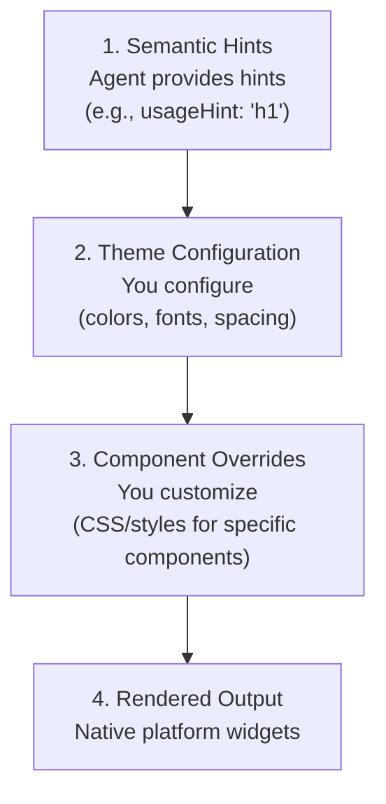

---
hide:
  - toc
---

<!-- markdownlint-disable MD041 -->
<!-- markdownlint-disable MD033 -->
<div style="text-align: center; margin: 2rem 0 3rem 0;" markdown>

<!-- Logo for Light Mode (shows dark logo on light background) -->

<!-- Logo for Dark Mode (shows light logo on dark background) -->


# A Protocol for Agent-Driven Interfaces

<p style="font-size: 1.2rem; max-width: 800px; margin: 0 auto 1rem auto; opacity: 0.9; line-height: 1.6;">
A2UI enables AI agents to generate rich, interactive user interfaces that render natively across web, mobile, and desktop—without executing arbitrary code.
</p>

</div>

!!! warning "️Status: Early Stage Public Preview"
    A2UI is currently in **v0.8 (Public Preview)**. The specification and
    implementations are functional but are still evolving. We are opening the project to
    foster collaboration, gather feedback, and solicit contributions (e.g., on client renderers).
    Expect changes.

## At a Glance

A2UI is currently [v0.8](specification/v0.8-a2ui.md),
Apache 2.0 licensed,
created by Google with contributions from CopilotKit and the open source community,
and is in active development [on GitHub](https://github.com/google/A2UI).

The problem A2UI solves is: **how can AI agents safely send rich UIs across trust boundaries?**

Instead of text-only responses or risky code execution, A2UI lets agents send **declarative component descriptions** that clients render using their own native widgets. It's like having agents speak a universal UI language.

In this repo you will find
[A2UI specifications](specification/v0.8-a2ui.md)
and implementations for
[renderers](renderers.md) (eg: Angular, Flutter, etc.) on the client side,
and [transports](/transports.md) (eg: A2A, etc.) which communicate A2UI messages between agents and clients.

<div class="grid cards" markdown>

- :material-shield-check: **Secure by Design**

    ---

    Declarative data format, not executable code. Agents can only use pre-approved components from your catalog—no UI injection attacks.

- :material-rocket-launch: **LLM-Friendly**

    ---

    Flat, streaming JSON structure designed for easy generation. LLMs can build UIs incrementally without perfect JSON in one shot.

- :material-devices: **Framework-Agnostic**

    ---

    One agent response works everywhere. Render the same UI on Angular, Flutter, React, or native mobile with your own styled components.

- :material-chart-timeline: **Progressive Rendering**

    ---

    Stream UI updates as they're generated. Users see the interface building in real-time instead of waiting for complete responses.

</div>

## Get Started in 5 Minutes

<div class="grid cards" markdown>

- :material-clock-fast:{ .lg .middle } **[Quickstart Guide](quickstart.md)**

    ---

    Run the restaurant finder demo and see A2UI in action with Gemini-powered agents.

    [:octicons-arrow-right-24: Get started](quickstart.md)

- :material-book-open-variant:{ .lg .middle } **[Core Concepts](concepts/overview.md)**

    ---

    Understand surfaces, components, data binding, and the adjacency list model.

    [:octicons-arrow-right-24: Learn concepts](concepts/overview.md)

- :material-code-braces:{ .lg .middle } **[Developer Guides](guides/client-setup.md)**

    ---

    Integrate A2UI renderers into your app or build agents that generate UIs.

    [:octicons-arrow-right-24: Start building](guides/client-setup.md)

- :material-file-document:{ .lg .middle } **[Protocol Reference](specification/v0.8-a2ui.md)**

    ---

    Dive into the complete technical specification and message types.

    [:octicons-arrow-right-24: Read the spec](specification/v0.8-a2ui.md)

</div>

## How It Works

1. **User sends a message** to an AI agent
2. **Agent generates A2UI messages** describing the UI (structure + data)
3. **Messages stream** to the client application
4. **Client renders** using native components (Angular, Flutter, React, etc.)
5. **User interacts** with the UI, sending actions back to the agent
6. **Agent responds** with updated A2UI messages


## A2UI in Action

### Landscape Architect Demo

<div style="margin: 2rem 0;">
  <div style="border-radius: .8rem; overflow: hidden; box-shadow: var(--md-shadow-z2);">
    <video width="100%" height="auto" controls playsinline style="display: block; aspect-ratio: 16/9; object-fit: cover;">
      <source src="assets/landscape-architect-demo.mp4" type="video/mp4">
      Your browser does not support the video tag.
    </video>
  </div>
  <p style="text-align: center; margin-top: 1rem; opacity: 0.8;">
    Watch an agent generate all of the interfaces for a landscape architect application. The user uploads a photo; the agent uses Gemini to understand it and generate a custom form for landscaping needs.
  </p>
</div>

### Custom Components: Interactive Charts & Maps

<div style="margin: 2rem 0;">
  <div style="border-radius: .8rem; overflow: hidden; box-shadow: var(--md-shadow-z2);">
    <video width="100%" height="auto" controls playsinline style="display: block; aspect-ratio: 16/9; object-fit: cover;">
      <source src="assets/a2ui-custom-compnent.mp4" type="video/mp4">
      Your browser does not support the video tag.
    </video>
  </div>
  <p style="text-align: center; margin-top: 1rem; opacity: 0.8;">
    Watch an agent chose to respond with a chart component to answer a numerical summary question.  Then the agent chooses a Google Map component to answer a location question.  Both are custom components offered by the client.
  </p>
</div>

### A2UI Composer

CopilotKit has a public [A2UI Widget Builder](https://go.copilotkit.ai/A2UI-widget-builder) to try out as well.

[](https://go.copilotkit.ai/A2UI-widget-builder). # What is A2UI?

**A2UI (Agent to UI) is a declarative UI protocol for agent-driven interfaces.** AI agents generate rich, interactive UIs that render natively across platforms (web, mobile, desktop) without executing arbitrary code.

## The Problem

**Text-only agent interactions are inefficient:**

```
User: "Book a table for 2 tomorrow at 7pm"
Agent: "Okay, for what day?"
User: "Tomorrow"
Agent: "What time?"
...
```

**Better:** Agent generates a form with date picker, time selector, and submit button. Users interact with UI, not text.

## The Challenge

In multi-agent systems, agents often run remotely (different servers, organizations). They can't directly manipulate your UI—they must send messages.

**Traditional approach:** Send HTML/JavaScript in iframes

- Heavy, visually disjointed
- Security complexity
- Doesn't match app styling

**Need:** Transmit UI that's safe like data, expressive like code.

## The Solution

A2UI: JSON messages describing UI that:

- LLMs generate as structured output
- Travel over any transport (A2A, AG UI, SSE, WebSockets)
- Client renders using its own native components

**Result:** Client controls security and styling, agent-generated UI feels native.

### Example

```json
{"surfaceUpdate": {"surfaceId": "booking", "components": [
  {"id": "title", "component": {"Text": {"text": {"literalString": "Book Your Table"}, "usageHint": "h1"}}},
  {"id": "datetime", "component": {"DateTimeInput": {"value": {"path": "/booking/date"}, "enableDate": true}}},
  {"id": "submit-text", "component": {"Text": {"text": {"literalString": "Confirm"}}}},
  {"id": "submit-btn", "component": {"Button": {"child": "submit-text", "action": {"name": "confirm_booking"}}}}
]}}
```

```json
{"dataModelUpdate": {"surfaceId": "booking", "contents": [
  {"key": "booking", "valueMap": [{"key": "date", "valueString": "2025-12-16T19:00:00Z"}]}
]}}
```

```json
{"beginRendering": {"surfaceId": "booking", "root": "title"}}
```

Client renders these messages as native components (Angular, Flutter, React, etc.).

## Core Value

**1. Security:** Declarative data, not code. Agent requests components from client's trusted catalog. No code execution risk.

**2. Native Feel:** No iframes. Client renders with its own UI framework. Inherits app styling, accessibility, performance.

**3. Portability:** One agent response works everywhere. Same JSON renders on web (Lit/Angular/React), mobile (Flutter/SwiftUI/Jetpack Compose), desktop.

## Design Principles

**1. LLM-Friendly:** Flat component list with ID references. Easy to generate incrementally, correct mistakes, stream.

**2. Framework-Agnostic:** Agent sends abstract component tree. Client maps to native widgets (web/mobile/desktop).

**3. Separation of Concerns:** Three layers—UI structure, application state, client rendering. Enables data binding, reactive updates, clean architecture.

## What A2UI Is NOT

- Not a framework (it's a protocol)
- Not a replacement for HTML (for agent-generated UIs, not static sites)
- Not a robust styling system (client controls styling with limited serverside styling support)
- Not limited to web (works on mobile and desktop)

## Key Concepts

- **Surface**: Canvas for components (dialog, sidebar, main view)
- **Component**: UI element (Button, TextField, Card, etc.)
- **Data Model**: Application state, components bind to it
- **Catalog**: Available component types
- **Message**: JSON object (`surfaceUpdate`, `dataModelUpdate`, `beginRendering`, etc.)

For a comparison of similar projects, see [Agent UI Ecosystem](agent-ui-ecosystem.md).# Who is A2UI For?

Developers building AI agents with rich, interactive UIs.

## Three Audiences

### 1. Host App Developers (Frontend)

Build multi-agent platforms, enterprise assistants, or cross-platform apps where agents generate UI.

**Why A2UI:**

- Brand control: client owns styling and design system
- Multi-agent: support local, remote, and third-party agents
- Secure: declarative data, no code execution
- Cross-platform: web, mobile, desktop
- Interoperable: open source, same spec with multiple renderers

**Get started:** [Client Setup](../guides/client-setup.md) | [Theming](../guides/theming.md) | [Custom Components](../guides/custom-components.md)

### 2. Agent Developers (Backend/AI)

Build agents that generate forms, dashboards, and interactive workflows.

**Why A2UI:**

- LLM-friendly: flat structure, easy to generate incrementally
- Rich interactions: beyond text (forms, tables, visualizations)
- Generations not tools: UI as part of the generated output from the agent
- Portable: one agent response works across all A2UI clients
- Streamable: progressive rendering as you generate

**Get started:** [Agent Development](../guides/agent-development.md)

### 3. Platform Builders (SDK Creators)

Build agent orchestration platforms, frameworks, or UI integrations.  

Do you bring remote agents into your app?

Do you ship your agent into other apps you don't necessarily control?

**Why A2UI:**

- Standard protocol: interoperable with A2A and other transports
- Extensible: custom component catalogs
- Open source (Apache 2.0)

**Get started:** [Community](../community.md) | [Roadmap](../roadmap.md)

---

## When to Use A2UI

- ✅ **Agent-generated UI** - Core purpose
- ✅ **Multi-agent systems** - Standard protocol across trust boundaries
- ✅ **Cross-platform apps** - One agent, many renderers (web/mobile/desktop)
- ✅ **Security critical** - Declarative data, no code execution
- ✅ **Brand consistency** - Client controls styling

- ❌ **Static websites** - Use HTML/CSS
- ❌ **Simple text-only chat** - Use Markdown
- ❌ **Remote widgets not integrated with client** - Use iframes, like MCP Apps
<!-- TODO: figure out when to use AG UI vs when to use A2UI -->
- ❌ **Rapid UI + Agent app built together** - Use AG UI / CopilotKit
<!-- TODO: Document styling constraints - agents use semantic hints (usageHint), not pixel-perfect control --># How Can I Use A2UI?

Choose the integration path that matches your role and use case.

## Three Paths

### Path 1: Building a Host Application (Frontend)

Integrate A2UI rendering into your existing app or build a new agent-powered frontend.

**Choose a renderer:**

- **Web:** Lit, Angular
- **Mobile/Desktop:** Flutter GenUI SDK
- **React:** Coming Q1 2026

**Quick setup:**

If we are using an Angular app, we can add the Angular renderer:

```bash
npm install @a2ui/angular 
```

Connect to agent messages (SSE, WebSockets, or A2A) and customize styling to match your brand.

**Next:** [Client Setup Guide](../guides/client-setup.md) | [Theming](../guides/theming.md)

---

### Path 2: Building an Agent (Backend)

Create an agent that generates A2UI responses for any compatible client.

**Choose your framework:**

- **Python:** Google ADK, LangChain, custom
- **Node.js:** A2A SDK, Vercel AI SDK, custom

Include the A2UI schema in your LLM prompts, generate JSONL messages, and stream to clients over SSE, WebSockets, or A2A.

**Next:** [Agent Development Guide](../guides/agent-development.md)

---

### Path 3: Using an Existing Framework

Use A2UI through frameworks with built-in support:

- **[AG UI / CopilotKit](https://ag-ui.com/)** - Full-stack React framework with A2UI rendering
- **[Flutter GenUI SDK](https://docs.flutter.dev/ai/genui)** - Cross-platform generative UI (uses A2UI internally)

**Next:** [Agent UI Ecosystem](agent-ui-ecosystem.md) | [Where is A2UI Used?](where-is-it-used.md)
# A2UI in the Agent Ecosystem

The space for agentic UI is evolving rapidly, with excellent tools emerging to solve different parts of the stack. A2UI is not a replacement for these frameworks—it's a specialized protocol that solves the specific problem of **interoperable, cross-platform, generative or template-based UI responses.**

## At a glance

The A2UI approach is to send JSON as a message to the client, which then uses a renderer to convert it into native UI components.  LLMs can generate the component layout on the fly or you can use a template.

!!! tip ""
    **This makes it secure like data, and expressive like code.**

This rest of this page will help you understand A2UI in relationship to other options.

## Navigating the Agentic UI Ecosystem

### 1. Building the "Host" Application UI

If you're building a full-stack application (the "host" UI that the user interacts with), in addition to building the actual UI, you may also utilize a framework **(AG UI / CopilotKit, Vercel AI SDK, GenUI SDK for Flutter which already uses A2UI under the covers)** to handle the "pipes": state synchronization, chat history, and input handling.

**Where A2UI fits:** A2UI is complementary. If you connect your host application using AG UI, it can use A2UI as the data format for rendering responses from the host agent and also from third-party or remote agents. This gives you the best of both worlds: a rich, stateful host app that can safely render content from external agents it doesn't control.

- **A2UI with A2A:** You can send via A2A directly to a client front end.
- **A2UI with AG UI:** You can send via AG UI directly to a client front end.
- A2UI with REST, SSE, WebSockets and other transports are feasible but not yet available.

### 2. UI as a "Resource" (MCP Apps)

The **Model Context Protocol (MCP)** has [recently introduced **MCP Apps**](https://blog.modelcontextprotocol.io/posts/2025-11-21-mcp-apps/), a new standard consolidating the great work from MCP-UI and OpenAI to enable servers to provide interactive interfaces. This approach treats UI as a resource (accessed via a `ui://` URI) that tools can return, typically rendering pre-built HTML content within a sandboxed `iframe` to ensure isolation and security.

**How A2UI is different:** A2UI takes a "native-first" approach that is distinct from the resource-fetching model of MCP Apps. Instead of retrieving an opaque payload to display in a sandbox, an A2UI agent sends a blueprint of native components. This allows the UI to inherit the host app's styling and accessibility features perfectly. In a multi-agent system, an orchestrator agent can easily understand the lightweight A2UI message content from a subagent, allowing for more fluid collaboration between agents.

### 3. Platform-Specific Ecosystems (OpenAI ChatKit)

Tools like **ChatKit** offer a highly integrated, optimized experience for deploying agents specifically within the OpenAI ecosystem.

**How A2UI is different:** A2UI is designed for developers building their own agentic surfaces across Web, Flutter, and native mobile, or for enterprise meshes (like **A2A**) where agents need to communicate across trust boundaries. A2UI gives the client more control over styling at the expense of the agent, in order to allow for greater visual consistency with the host client application.
# Quickstart: Run A2UI in 5 Minutes

Get hands-on with A2UI by running the restaurant finder demo. This guide will have you experiencing agent-generated UI in less than 5 minutes.

## What You'll Build

By the end of this quickstart, you'll have:

- ✅ A running web app with A2UI Lit renderer
- ✅ A Gemini-powered agent that generates dynamic UIs
- ✅ An interactive restaurant finder with form generation, time selection, and confirmation flows
- ✅ Understanding of how A2UI messages flow from agent to UI

## Prerequisites

Before you begin, make sure you have:

- **Node.js** (v18 or later) - [Download here](https://nodejs.org/)
- **A Gemini API key** - [Get one free from Google AI Studio](https://aistudio.google.com/apikey)

!!! warning "Security Notice"
    This demo runs an A2A agent that uses Gemini to generate A2UI responses. The agent has access to your API key and will make requests to Google's Gemini API. Always review agent code before running it in production environments.

## Step 1: Clone the Repository

```bash
git clone https://github.com/google/a2ui.git
cd a2ui
```

## Step 2: Set Your API Key

Export your Gemini API key as an environment variable:

```bash
export GEMINI_API_KEY="your_gemini_api_key_here"
```

## Step 3: Navigate to the Lit Client

```bash
cd samples/client/lit
```

## Step 4: Install and Run

Run the one-command demo launcher:

```bash
npm install
npm run demo:all
```

This command will:

1. Install all dependencies
2. Build the A2UI renderer
3. Start the A2A restaurant finder agent (Python backend)
4. Launch the development server
5. Open your browser to `http://localhost:5173`

!!! success "Demo Running"
    If everything worked, you should see the web app in your browser. The agent is now ready to generate UI!

## Step 5: Try It Out

In the web app, try these prompts:

1. **"Book a table for 2"** - Watch the agent generate a reservation form
2. **"Find Italian restaurants near me"** - See dynamic search results
3. **"What are your hours?"** - Experience different UI layouts for different intents

### What's Happening Behind the Scenes

```
┌─────────────┐         ┌──────────────┐         ┌────────────────┐
│   You Type  │────────>│ A2A Agent    │────────>│  Gemini API    │
│  a Message  │         │  (Python)    │         │  (LLM)         │
└─────────────┘         └──────────────┘         └────────────────┘
                               │                         │
                               │ Generates A2UI JSON     │
                               │<────────────────────────┘
                               │
                               │ Streams JSONL messages
                               v
                        ┌──────────────┐
                        │   Web App    │
                        │ (A2UI Lit    │
                        │  Renderer)   │
                        └──────────────┘
                               │
                               │ Renders native components
                               v
                        ┌──────────────┐
                        │   Your UI    │
                        └──────────────┘
```

1. **You send a message** via the web UI
2. **The A2A agent** receives it and sends the conversation to Gemini
3. **Gemini generates** A2UI JSON messages describing the UI
4. **The A2A agent streams** these messages back to the web app
5. **The A2UI renderer** converts them into native web components
6. **You see the UI** rendered in your browser

## Anatomy of an A2UI Message

Let's peek at what the agent is sending. Here's a simplified example of the JSON messages:

### Defining the UI

```json
{
  "surfaceUpdate": {
    "surfaceId": "main",
    "components": [
      {
        "id": "header",
        "component": {
          "Text": {
            "text": {"literalString": "Book Your Table"},
            "usageHint": "h1"
          }
        }
      },
      {
        "id": "date-picker",
        "component": {
          "DateTimeInput": {
            "label": {"literalString": "Select Date"},
            "value": {"path": "/reservation/date"},
            "enableDate": true
          }
        }
      },
      {
        "id": "submit-btn",
        "component": {
          "Button": {
            "child": "submit-text",
            "action": {"name": "confirm_booking"}
          }
        }
      },
      {
        "id": "submit-text",
        "component": {
          "Text": {"text": {"literalString": "Confirm Reservation"}}
        }
      }
    ]
  }
}
```

This defines the UI components for the surface: a text header, a date picker, and a button.

### Populating Data

```json
{
  "dataModelUpdate": {
    "surfaceId": "main",
    "contents": [
      {
        "key": "reservation",
        "valueMap": [
          {"key": "date", "valueString": "2025-12-15"},
          {"key": "time", "valueString": "19:00"},
          {"key": "guests", "valueInt": 2}
        ]
      }
    ]
  }
}
```

This populates the data model that components can bind to.

### Signaling Render

```json
{"beginRendering": {"surfaceId": "main", "root": "header"}}
```

This tells the client it has enough information to render the UI.

!!! tip "It's Just JSON"
    Notice how readable and structured this is? LLMs can generate this easily, and it's safe to transmit and render—no code execution required.

## Exploring Other Demos

The repository includes several other demos:

### Component Gallery (No Agent Required)

See all available A2UI components:

```bash
npm start -- gallery
```

This runs a client-only demo showcasing every standard component (Card, Button, TextField, Timeline, etc.) with live examples and code samples.

### Contact Lookup Demo

Try a different agent use case:

```bash
npm run demo:contact
```

This demonstrates a contact lookup agent that generates search forms and result lists.

## What's Next?

Now that you've seen A2UI in action, you're ready to:

- **[Learn Core Concepts](concepts/overview.md)**: Understand surfaces, components, and data binding
- **[Set Up Your Own Client](guides/client-setup.md)**: Integrate A2UI into your own app
- **[Build an Agent](guides/agent-development.md)**: Create agents that generate A2UI responses
- **[Explore the Protocol](reference/messages.md)**: Dive into the technical specification

## Troubleshooting

### Port Already in Use

If port 5173 is already in use, the dev server will automatically try the next available port. Check the terminal output for the actual URL.

### API Key Issues

If you see errors about missing API keys:

1. Verify the key is exported: `echo $GEMINI_API_KEY`
2. Make sure it's a valid Gemini API key from [Google AI Studio](https://aistudio.google.com/apikey)
3. Try re-exporting: `export GEMINI_API_KEY="your_key"`

### Python Dependencies

The demo uses Python for the A2A agent. If you encounter Python errors:

```bash
# Make sure Python 3.10+ is installed
python3 --version

# The demo should auto-install dependencies via the npm script
# If not, manually install them:
cd ../../agent/adk/restaurant_finder
pip install -r requirements.txt
```

### Still Having Issues?

- Check the [GitHub Issues](https://github.com/google/a2ui/issues)
- Review the [samples/client/lit/README.md](https://github.com/google/a2ui/tree/main/samples/client/lit)
- Join the community discussions

## Understanding the Demo Code

Want to see how it works? Check out:

- **Agent Code**: `samples/agent/adk/restaurant_finder/` - The Python A2A agent
- **Client Code**: `samples/client/lit/` - The Lit web client with A2UI renderer
- **A2UI Renderer**: `web-lib/` - The web renderer implementation

Each directory has its own README with detailed documentation.

---

**Congratulations!** You've successfully run your first A2UI application. You've seen how an AI agent can generate rich, interactive UIs that render natively in a web application—all through safe, declarative JSON messages.# A2UI Composer

Try building A2UI widgets interactively with the **CopilotKit A2UI Widget Builder**.

[](https://go.copilotkit.ai/A2UI-widget-builder)

**[Launch Widget Builder →](https://go.copilotkit.ai/A2UI-widget-builder)**

## What it does

- Experiment with A2UI components visually
- Generate A2UI JSON by describing what you want
- See real-time previews
- Copy JSON to use in your agents

Built by the [CopilotKit](https://www.copilotkit.ai/) team.
# Client Setup Guide

Integrate A2UI into your application using the renderer for your platform.

## Renderers

| Renderer                 | Platform           | Status            |
| ------------------------ | ------------------ | ----------------- |
| **Lit (Web Components)** | Web                | ✅ Stable          |
| **Angular**              | Web                | ✅ Stable          |
| **Flutter (GenUI SDK)**  | Mobile/Desktop/Web | ✅ Stable          |
| **React**                | Web                | 🚧 Coming Q1 2026  |
| **SwiftUI**              | iOS/macOS          | 🚧 Planned Q2 2026 |
| **Jetpack Compose**      | Android            | 🚧 Planned Q2 2026 |

## Web Components (Lit)

!!! warning "Attention"
    The Lit client library is not yet published to NPM. Check back in the
    coming days.

```bash
npm install @a2ui/web-lib lit @lit-labs/signals
```

The Lit renderer uses:

- **Message Processor**: Manages A2UI state and processes incoming messages
- **`<a2ui-surface>` component**: Renders surfaces in your app
- **Lit Signals**: Provides reactive state management for automatic UI updates

TODO: Add verified setup example.

**See working example:** [Lit shell sample](https://github.com/google/a2ui/tree/main/samples/client/lit/shell)

## Angular

!!! warning "Attention"
    The Angular client library is not yet published to NPM. Check back in the
    coming days.

```bash
npm install @a2ui/angular @a2ui/web-lib
```

The Angular renderer provides:

- **`provideA2UI()` function**: Configures A2UI in your app config
- **`Surface` component**: Renders A2UI surfaces
- **`MessageProcessor` service**: Handles incoming A2UI messages

TODO: Add verified setup example.

**See working example:** [Angular restaurant sample](https://github.com/google/a2ui/tree/main/samples/client/angular/projects/restaurant)

## Flutter (GenUI SDK)

```bash
flutter pub add flutter_genui
```

Flutter uses the GenUI SDK which provides native A2UI rendering.

**Docs:** [GenUI SDK](https://docs.flutter.dev/ai/genui) | [GitHub](https://github.com/flutter/genui) | [README in GenUI Flutter Package](https://github.com/flutter/genui/blob/main/packages/genui/README.md#getting-started-with-genui)

## Connecting to Agents

Your client application needs to:
1. **Receive A2UI messages** from the agent (via transport)
2. **Process messages** using the Message Processor
3. **Send user actions** back to the agent

Common transport options:
- **Server-Sent Events (SSE)**: One-way streaming from server to client
- **WebSockets**: Bidirectional real-time communication
- **A2A Protocol**: Standardized agent-to-agent communication with A2UI support

TODO: Add transport implementation examples.

**See:** [Transports guide](../transports.md)

## Handling User Actions

When users interact with A2UI components (clicking buttons, submitting forms, etc.), the client:
1. Captures the action event from the component
2. Resolves any data context needed for the action
3. Sends the action to the agent
4. Processes the agent's response messages

TODO: Add action handling examples.

## Error Handling

Common errors to handle:
- **Invalid Surface ID**: Surface referenced before `beginRendering` was received
- **Invalid Component ID**: Component IDs must be unique within a surface
- **Invalid Data Path**: Check data model structure and JSON Pointer syntax
- **Schema Validation Failed**: Verify message format matches A2UI specification

TODO: Add error handling examples.

## Next Steps

- **[Quickstart](../quickstart.md)**: Try the demo application
- **[Theming & Styling](theming.md)**: Customize the look and feel
- **[Custom Components](custom-components.md)**: Extend the component catalog
- **[Agent Development](agent-development.md)**: Build agents that generate A2UI
- **[Reference Documentation](../reference/messages.md)**: Deep dive into the protocol
# Agent Development Guide

Build AI agents that generate A2UI interfaces. This guide covers generating and streaming UI messages from LLMs.

## Quick Overview

Building an A2UI agent:

1. **Understand user intent** → Decide what UI to show
2. **Generate A2UI JSON** → Use LLM structured output or prompts
3. **Validate & stream** → Check schema, send to client
4. **Handle actions** → Respond to user interactions

## Start with a simple agent

We will use the ADK to build a simple agent.  We will start with text and eventually upgrade it to A2UI.

See step-by-step instructions at the [ADK quickstart](https://google.github.io/adk-docs/get-started/python/).

```bash
pip install google-adk
adk create my_agent
```

Then edit the `my_agent/agent.py` file with a very simple agent for restaurant recommendations.

```python
import json
from google.adk.agents.llm_agent import Agent
from google.adk.tools.tool_context import ToolContext

def get_restaurants(tool_context: ToolContext) -> str:
    """Call this tool to get a list of restaurants."""
    return json.dumps([
        {
            "name": "Xi'an Famous Foods",
            "detail": "Spicy and savory hand-pulled noodles.",
            "imageUrl": "http://localhost:10002/static/shrimpchowmein.jpeg",
            "rating": "★★★★☆",
            "infoLink": "[More Info](https://www.xianfoods.com/)",
            "address": "81 St Marks Pl, New York, NY 10003"
        },
        {
            "name": "Han Dynasty",
            "detail": "Authentic Szechuan cuisine.",
            "imageUrl": "http://localhost:10002/static/mapotofu.jpeg",
            "rating": "★★★★☆",
            "infoLink": "[More Info](https://www.handynasty.net/)",
            "address": "90 3rd Ave, New York, NY 10003"
        },
        {
            "name": "RedFarm",
            "detail": "Modern Chinese with a farm-to-table approach.",
            "imageUrl": "http://localhost:10002/static/beefbroccoli.jpeg",
            "rating": "★★★★☆",
            "infoLink": "[More Info](https://www.redfarmnyc.com/)",
            "address": "529 Hudson St, New York, NY 10014"
        },
    ])

AGENT_INSTRUCTION="""
You are a helpful restaurant finding assistant. Your goal is to help users find and book restaurants using a rich UI.

To achieve this, you MUST follow this logic:

1.  **For finding restaurants:**
    a. You MUST call the `get_restaurants` tool. Extract the cuisine, location, and a specific number (`count`) of restaurants from the user's query (e.g., for "top 5 chinese places", count is 5).
    b. After receiving the data, you MUST follow the instructions precisely to generate the final a2ui UI JSON, using the appropriate UI example from the `prompt_builder.py` based on the number of restaurants."""

root_agent = Agent(
    model='gemini-2.5-flash',
    name="restaurant_agent",
    description="An agent that finds restaurants and helps book tables.",
    instruction=AGENT_INSTRUCTION,
    tools=[get_restaurants],
)
```

Don't forget to set the `GOOGLE_API_KEY` environment variable to run this example.  

```bash
echo 'GOOGLE_API_KEY="YOUR_API_KEY"' > .env
```

You can test out this agent with the ADK web interface:

```bash
adk web
```

Select `my_agent` from the list, and ask questions about restaurants in New York.  You should see a list of restaurants in the UI as plain text.

## Generating A2UI Messages

Getting the LLM to generate A2UI messages requires some prompt engineering.  

!!! warning "Attention"
    This is an area we are still designing.  The developer ergonomics of this are not yet finalized.

For now, let's copy the `a2ui_schema.py` from the contact lookup example.  This is the easiest way to get the A2UI schema and examples for your agent (subject to change).

```bash
cp samples/agent/adk/contact_lookup/a2ui_schema.py my_agent/
```

First lets add the new imports to the `agent.py` file:

```python
# The schema for any A2UI message.  This never changes.
from .a2ui_schema import A2UI_SCHEMA
```

Now we will modify the agent instructions to generate A2UI messages instead of plain text.  We will leave a placeholder for future UI examples.

```python

# Eventually you can copy & paste some UI examples here, for few-shot in context learning
RESTAURANT_UI_EXAMPLES = """
"""

# Construct the full prompt with UI instructions, examples, and schema
A2UI_AND_AGENT_INSTRUCTION = AGENT_INSTRUCTION + f"""

Your final output MUST be a a2ui UI JSON response.

To generate the response, you MUST follow these rules:
1.  Your response MUST be in two parts, separated by the delimiter: `---a2ui_JSON---`.
2.  The first part is your conversational text response.
3.  The second part is a single, raw JSON object which is a list of A2UI messages.
4.  The JSON part MUST validate against the A2UI JSON SCHEMA provided below.

--- UI TEMPLATE RULES ---
-   If the query is for a list of restaurants, use the restaurant data you have already received from the `get_restaurants` tool to populate the `dataModelUpdate.contents` array (e.g., as a `valueMap` for the "items" key).
-   If the number of restaurants is 5 or fewer, you MUST use the `SINGLE_COLUMN_LIST_EXAMPLE` template.
-   If the number of restaurants is more than 5, you MUST use the `TWO_COLUMN_LIST_EXAMPLE` template.
-   If the query is to book a restaurant (e.g., "USER_WANTS_TO_BOOK..."), you MUST use the `BOOKING_FORM_EXAMPLE` template.
-   If the query is a booking submission (e.g., "User submitted a booking..."), you MUST use the `CONFIRMATION_EXAMPLE` template.

{RESTAURANT_UI_EXAMPLES}

---BEGIN A2UI JSON SCHEMA---
{A2UI_SCHEMA}
---END A2UI JSON SCHEMA---
"""

root_agent = Agent(
    model='gemini-2.5-flash',
    name="restaurant_agent",
    description="An agent that finds restaurants and helps book tables.",
    instruction=A2UI_AND_AGENT_INSTRUCTION,
    tools=[get_restaurants],
)
```

## Understanding the Output

Your agent will no longer strictly output text. Instead, it will output text and a **JSON list** of A2UI messages.

The `A2UI_SCHEMA` that we imported is a standard JSON schema that defines valid operations like:

* `render` (displaying a UI)
* `update` (changing data in an existing UI)

Because the output is structured JSON, you may parse and validate it before sending it to the client.

```python
# 1. Parse the JSON
# Warning: Parsing the output as JSON is a fragile implementation useful for documentation.
# LLMs often put Markdown fences around JSON output, and can make other mistakes.
# Rely on frameworks to parse the JSON for you.
parsed_json_data = json.loads(json_string_cleaned)

# 2. Validate against A2UI_SCHEMA
# This ensures the LLM generated valid A2UI commands
jsonschema.validate(
    instance=parsed_json_data, schema=self.a2ui_schema_object
)
```

By validating the output against `A2UI_SCHEMA`, you ensure that your client never receives malformed UI instructions.

TODO: Continue this guide with examples of how to parse, validate, and send the output to the client renderer   without the A2A extension.
# Custom Component Catalogs

Extend A2UI by defining **custom catalogs** that include your own components alongside standard A2UI components.

## Why Custom Catalogs?

The A2UI Standard Catalog provides common UI elements (buttons, text fields, etc.), but your application might need specialized components:

- **Domain-specific widgets**: Stock tickers, medical charts, CAD viewers
- **Third-party integrations**: Google Maps, payment forms, chat widgets
- **Brand-specific components**: Custom date pickers, product cards, dashboards

**Custom catalogs** are collections of components that can include:
- Standard A2UI components (Text, Button, TextField, etc.)
- Your custom components (GoogleMap, StockTicker, etc.)
- Third-party components

You register entire catalogs with your client application, not individual components. This allows agents and clients to agree on a shared, extended set of components while maintaining security and type safety.

## How Custom Catalogs Work

1.  **Client Defines Catalog**: You create a catalog definition that lists both standard and custom components.
2.  **Client Registers Catalog**: You register the catalog (and its component implementations) with your client app.
3.  **Client Announces Support**: The client informs the agent which catalogs it supports.
4.  **Agent Selects Catalog**: The agent chooses a catalog for a given UI surface.
5.  **Agent Generates UI**: The agent generates `surfaceUpdate` messages using components from that catalog by name.

## Defining Custom Catalogs

TODO: Add detailed guide for defining custom catalogs for each platform.

**Web (Lit / Angular):**
- How to define a catalog with both standard and custom components
- How to register the catalog with the A2UI client
- How to implement custom component classes

**Flutter:**
- How to define custom catalogs using GenUI
- How to register custom component renderers

**See working examples:**
- [Lit samples](https://github.com/google/a2ui/tree/main/samples/client/lit)
- [Angular samples](https://github.com/google/a2ui/tree/main/samples/client/angular)
- [Flutter GenUI docs](https://docs.flutter.dev/ai/genui)

## Agent-Side: Using Components from a Custom Catalog

Once a catalog is registered on the client, agents can use components from it in `surfaceUpdate` messages.

The agent specifies which catalog to use via the `catalogId` in the `beginRendering` message.

TODO: Add examples of:
- How agents select catalogs
- How agents reference custom components from catalogs
- How catalog versioning works

## Data Binding and Actions

Custom components support the same data binding and action mechanisms as standard components:

- **Data binding**: Custom components can bind properties to data model paths using JSON Pointer syntax
- **Actions**: Custom components can emit actions that the agent receives and handles

## Security Considerations

When creating custom catalogs and components:

1. **Allowlist components**: Only register components you trust in your catalogs
2. **Validate properties**: Always validate component properties from agent messages
3. **Sanitize user input**: If components accept user input, sanitize it before processing
4. **Limit API access**: Don't expose sensitive APIs or credentials to custom components

TODO: Add detailed security best practices and code examples.

## Next Steps

- **[Theming & Styling](theming.md)**: Customize the look and feel of components
- **[Component Reference](../reference/components.md)**: See all standard components
- **[Agent Development](agent-development.md)**: Build agents that use custom components
# Theming & Styling

Customize the look and feel of A2UI components to match your brand.

## The A2UI Styling Philosophy

A2UI follows a **client-controlled styling** approach:

- **Agents describe *what* to show** (components and structure)
- **Clients decide *how* it looks** (colors, fonts, spacing)

This ensures:

- ✅ **Brand consistency**: All UIs match your app's design system
- ✅ **Security**: Agents can't inject arbitrary CSS or styling
- ✅ **Accessibility**: You control contrast, focus states, and ARIA attributes
- ✅ **Platform-native feel**: Web apps look like web, mobile looks like mobile

## Styling Layers

A2UI styling works in layers:



## Layer 1: Semantic Hints

Agents provide semantic hints (not visual styles) to guide client rendering:

```json
{
  "id": "title",
  "component": {
    "Text": {
      "text": {"literalString": "Welcome"},
      "usageHint": "h1"
    }
  }
}
```

**Common `usageHint` values:**
- Text: `h1`, `h2`, `h3`, `h4`, `h5`, `body`, `caption`
- Other components have their own hints (see [Component Reference](../reference/components.md))

The client renderer maps these semantic hints to actual visual styles based on your theme and design system.

## Layer 2: Theme Configuration

Each renderer provides a way to configure your design system globally, including:

- **Colors**: Primary, secondary, background, surface, error, success, etc.
- **Typography**: Font families, sizes, weights, line heights
- **Spacing**: Base units and scale (xs, sm, md, lg, xl)
- **Shapes**: Border radius values
- **Elevation**: Shadow styles for depth

TODO: Add platform-specific theming guides:

**Web (Lit):**
- How to configure theme via renderer initialization
- Available theme properties

**Angular:**
- Integration with Angular Material theming
- Standalone A2UI theme configuration

**Flutter:**
- How A2UI uses Flutter's `ThemeData`
- Custom theme properties

**See working examples:**
- [Lit samples](https://github.com/google/a2ui/tree/main/samples/client/lit)
- [Angular samples](https://github.com/google/a2ui/tree/main/samples/client/angular)
- [Flutter GenUI docs](https://docs.flutter.dev/ai/genui)

## Layer 3: Component Overrides

Beyond global theming, you can override styles for specific components:

**Web renderers:**
- CSS custom properties (CSS variables) for fine-grained control
- Standard CSS selectors for component-specific overrides

**Flutter:**
- Widget-specific theme overrides via `ThemeData`

TODO: Add detailed component override examples for each platform.

## Common Styling Features

### Dark Mode

A2UI renderers typically support automatic dark mode based on system preferences:

- Auto-detect system theme (`prefers-color-scheme`)
- Manual light/dark theme selection
- Custom dark theme configuration

TODO: Add dark mode configuration examples.

### Responsive Design

A2UI components are responsive by default. You can further customize responsive behavior:

- Media queries for different screen sizes
- Container queries for component-level responsiveness
- Responsive spacing and typography scales

TODO: Add responsive design examples.

### Custom Fonts

Load and use custom fonts in your A2UI application:

- Web fonts (Google Fonts, etc.)
- Self-hosted fonts
- Platform-specific font loading

TODO: Add custom font examples.

## Best Practices

### 1. Use Semantic Hints, Not Visual Properties

Agents should provide semantic hints (`usageHint`), never visual styles:

```json
// ✅ Good: Semantic hint
{
  "component": {
    "Text": {
      "text": {"literalString": "Welcome"},
      "usageHint": "h1"
    }
  }
}

// ❌ Bad: Visual properties (not supported)
{
  "component": {
    "Text": {
      "text": {"literalString": "Welcome"},
      "fontSize": 24,
      "color": "#FF0000"
    }
  }
}
```

### 2. Maintain Accessibility

- Ensure sufficient color contrast (WCAG AA: 4.5:1 for normal text, 3:1 for large text)
- Test with screen readers
- Support keyboard navigation
- Test in both light and dark modes

### 3. Use Design Tokens

Define reusable design tokens (colors, spacing, etc.) and reference them throughout your styles for consistency.

### 4. Test Across Platforms

- Test your theming on all target platforms (web, mobile, desktop)
- Verify both light and dark modes
- Check different screen sizes and orientations
- Ensure consistent brand experience across platforms

## Next Steps

- **[Custom Components](custom-components.md)**: Build custom components with your styling
- **[Component Reference](../reference/components.md)**: See styling options for all components
- **[Client Setup](client-setup.md)**: Set up the renderer in your app
# Core Concepts

This section explains the fundamental architecture of A2UI. Understanding these concepts will help you build effective agent-driven interfaces.

## The Big Picture

A2UI is built around three core ideas:

1. **Streaming Messages**: UI updates flow as a sequence of JSON messages from agent to client
2. **Declarative Components**: UIs are described as data, not programmed as code
3. **Data Binding**: UI structure is separate from application state, enabling reactive updates

## Key Topics

### [Data Flow](data-flow.md)
How messages travel from agents to rendered UI. Includes a complete lifecycle example of a restaurant booking flow, transport options (SSE, WebSockets, A2A), progressive rendering, and error handling.

### [Component Structure](components.md)
A2UI's **adjacency list model** for representing component hierarchies. Learn why flat lists are better than nested trees, how to use static vs. dynamic children, and best practices for incremental updates.

### [Data Binding](data-binding.md)
How components connect to application state using JSON Pointer paths. Covers reactive components, dynamic lists, input bindings, and the separation of structure from state that makes A2UI powerful.

## Message Types

A2UI uses four message types:

- **`surfaceUpdate`**: Define or update UI components
- **`dataModelUpdate`**: Update application state
- **`beginRendering`**: Signal the client to render
- **`deleteSurface`**: Remove a UI surface

For complete technical details, see [Message Reference](../reference/messages.md).
# Data Flow

How messages flow from agents to UI.

## Architecture

```
Agent (LLM) → A2UI Generator → Transport (SSE/WS/A2A)
                                      ↓
Client (Stream Reader) → Message Parser → Renderer → Native UI
```


## Message Format

A2UI defines a sequence of JSON messages that describe the UI. When streamed, these messages are often formatted as **JSON Lines (JSONL)**, where each line is a complete JSON object.

```jsonl
{"surfaceUpdate":{"surfaceId":"main","components":[...]}}
{"dataModelUpdate":{"surfaceId":"main","contents":[{"key":"user","valueMap":[{"key":"name","valueString":"Alice"}]}]}}
{"beginRendering":{"surfaceId":"main","root":"root-component"}}
```

**Why this format?**

A sequence of self-contained JSON objects is streaming-friendly, easy for LLMs to generate incrementally, and resilient to errors.

## Lifecycle Example: Restaurant Booking

**User:** "Book a table for 2 tomorrow at 7pm"

**1. Agent defines UI structure:**

```json
{"surfaceUpdate": {"surfaceId": "booking", "components": [
  {"id": "root", "component": {"Column": {"children": {"explicitList": ["header", "guests-field", "submit-btn"]}}}},
  {"id": "header", "component": {"Text": {"text": {"literalString": "Confirm Reservation"}, "usageHint": "h1"}}},
  {"id": "guests-field", "component": {"TextField": {"label": {"literalString": "Guests"}, "text": {"path": "/reservation/guests"}}}},
  {"id": "submit-btn", "component": {"Button": {"child": "submit-text", "action": {"name": "confirm", "context": [{"key": "details", "value": {"path": "/reservation"}}]}}}}
]}}
```

**2. Agent populates data:**

```json
{"dataModelUpdate": {"surfaceId": "booking", "path": "/reservation", "contents": [
  {"key": "datetime", "valueString": "2025-12-16T19:00:00Z"},
  {"key": "guests", "valueString": "2"}
]}}
```

**3. Agent signals render:**

```json
{"beginRendering": {"surfaceId": "booking", "root": "root"}}
```

**4. User edits guests to "3"** → Client updates `/reservation/guests` automatically (no message to agent yet)

**5. User clicks "Confirm"** → Client sends action with updated data:

```json
{"userAction": {"name": "confirm", "surfaceId": "booking", "context": {"details": {"datetime": "2025-12-16T19:00:00Z", "guests": "3"}}}}
```

**6. Agent responds** → Updates UI or sends `{"deleteSurface": {"surfaceId": "booking"}}` to clean up

## Transport Options

- **A2A Protocol**: Multi-agent systems, can also be used for agent to UI communication
- **AG UI**: Bidirectional, real-time
- ... others

See [transports](../transports.md) for more details.

## Progressive Rendering

Instead of waiting for the entire response to be generated before showing anything to the user, chunks of the response can be streamed to the client as they are generated and progressively rendered.

Users see UI building in real-time instead of staring at a spinner.

## Error Handling

- **Malformed messages:** Skip and continue, or send error back to agent for correction
- **Network interruptions:** Display error state, reconnect, agent resends or resumes

## Performance

- **Batching:** Buffer updates for 16ms, batch render together
- **Diffing:** Compare old/new components, update only changed properties
- **Granular updates:** Update `/user/name` not entire `/` model
# Components & Structure

A2UI uses an **adjacency list model** for component hierarchies. Instead of nested JSON trees, components are a flat list with ID references.

## Why Flat Lists?

**Traditional nested approach:**

- LLM must generate perfect nesting in one pass
- Hard to update deeply nested components
- Difficult to stream incrementally

**A2UI adjacency list:**

- ✅ Flat structure, easy for LLMs to generate
- ✅ Send components incrementally
- ✅ Update any component by ID
- ✅ Clear separation of structure and data

## The Adjacency List Model

```json
{
  "surfaceUpdate": {
    "components": [
      {"id": "root", "component": {"Column": {"children": {"explicitList": ["greeting", "buttons"]}}}},
      {"id": "greeting", "component": {"Text": {"text": {"literalString": "Hello"}}}},
      {"id": "buttons", "component": {"Row": {"children": {"explicitList": ["cancel-btn", "ok-btn"]}}}},
      {"id": "cancel-btn", "component": {"Button": {"child": "cancel-text", "action": {"name": "cancel"}}}},
      {"id": "cancel-text", "component": {"Text": {"text": {"literalString": "Cancel"}}}},
      {"id": "ok-btn", "component": {"Button": {"child": "ok-text", "action": {"name": "ok"}}}},
      {"id": "ok-text", "component": {"Text": {"text": {"literalString": "OK"}}}}
    ]
  }
}
```

Components reference children by ID, not by nesting.

## Component Basics

Every component has:

1. **ID**: Unique identifier (`"welcome"`)
2. **Type**: Component type (`Text`, `Button`, `Card`)
3. **Properties**: Configuration specific to that type

```json
{"id": "welcome", "component": {"Text": {"text": {"literalString": "Hello"}, "usageHint": "h1"}}}
```

## The Standard Catalog

A2UI defines a standard catalog of components organized by purpose:

- **Layout**: Row, Column, List - arrange other components
- **Display**: Text, Image, Icon, Video, Divider - show information
- **Interactive**: Button, TextField, CheckBox, DateTimeInput, Slider - user input
- **Container**: Card, Tabs, Modal - group and organize content

For the complete component gallery with examples, see [Component Reference](../reference/components.md).

## Static vs. Dynamic Children

**Static (`explicitList`)** - Fixed list of child IDs:
```json
{"children": {"explicitList": ["back-btn", "title", "menu-btn"]}}
```

**Dynamic (`template`)** - Generate children from data array:
```json
{"children": {"template": {"dataBinding": "/items", "componentId": "item-template"}}}
```

For each item in `/items`, render the `item-template`. See [Data Binding](data-binding.md) for details.

## Hydrating with Values

Components get their values two ways:

- **Literal** - Fixed value: `{"text": {"literalString": "Welcome"}}`
- **Data-bound** - From data model: `{"text": {"path": "/user/name"}}`

LLMs can generate components with literal values or bind them to data paths for dynamic content.

## Composing Surfaces

Components compose into **surfaces** (widgets):

1. LLM generates component definitions via `surfaceUpdate`
2. LLM populates data via `dataModelUpdate`
3. LLM signals render via `beginRendering`
4. Client renders all components as native widgets

A surface is a complete, cohesive UI (form, dashboard, chat, etc.).

## Incremental Updates

- **Add** - Send new `surfaceUpdate` with new component IDs
- **Update** - Send `surfaceUpdate` with existing ID and new properties
- **Remove** - Update parent's `children` list to exclude removed IDs

The flat structure makes all updates simple ID-based operations.

## Custom Components

Beyond the standard catalog, clients can define custom components for domain-specific needs:

- **How**: Register custom component types in your renderer
- **What**: Charts, maps, custom visualizations, specialized widgets
- **Security**: Custom components still part of the client's trusted catalog

Custom components are _advertised_ from the client's renderer to the LLM. The LLM can then use them in addition to the standard catalog.

See [Custom Components Guide](../guides/custom-components.md) for implementation details.

## Best Practices

1. **Descriptive IDs**: Use `"user-profile-card"` not `"c1"`
2. **Shallow hierarchies**: Avoid deep nesting
3. **Separate structure from content**: Use data bindings, not literals
4. **Reuse with templates**: One template, many instances via dynamic children
# Data Binding

Data binding connects UI components to application state using JSON Pointer paths ([RFC 6901](https://tools.ietf.org/html/rfc6901)). It's what allows A2UI to efficiently define layouts for large arrays of data, or to show updated content without being regenerated from scratch.

## Structure vs. State

A2UI separates:

1. **UI Structure** (Components): What the interface looks like
2. **Application State** (Data Model): What data it displays

This enables: reactive updates, data-driven UIs, reusable templates, and bidirectional binding.

## The Data Model

Each surface has a JSON object holding state:

```json
{
  "user": {"name": "Alice", "email": "alice@example.com"},
  "cart": {
    "items": [{"name": "Widget", "price": 9.99, "quantity": 2}],
    "total": 19.98
  }
}
```

## JSON Pointer Paths

**Syntax:**

- `/user/name` - Object property
- `/cart/items/0` - Array index (zero-based)
- `/cart/items/0/price` - Nested path

**Example:**

```json
{"user": {"name": "Alice"}, "items": ["Apple", "Banana"]}
```

- `/user/name` → `"Alice"`
- `/items/0` → `"Apple"`

## Literal vs. Path Values

**Literal (fixed):**
```json
{"id": "title", "component": {"Text": {"text": {"literalString": "Welcome"}}}}
```

**Data-bound (reactive):**
```json
{"id": "username", "component": {"Text": {"text": {"path": "/user/name"}}}}
```

When `/user/name` changes from "Alice" to "Bob", the text **automatically updates** to "Bob".

## Reactive Updates

Components bound to data paths automatically update when the data changes:

```json
{"id": "status", "component": {"Text": {"text": {"path": "/order/status"}}}}
```

- **Initial:** `/order/status` = "Processing..." → displays "Processing..."
- **Update:** Send `dataModelUpdate` with `status: "Shipped"` → displays "Shipped"

No component updates needed—just data updates.

## Dynamic Lists

Use templates to render arrays:

```json
{
  "id": "product-list",
  "component": {
    "Column": {
      "children": {"template": {"dataBinding": "/products", "componentId": "product-card"}}
    }
  }
}
```

**Data:**
```json
{"products": [{"name": "Widget", "price": 9.99}, {"name": "Gadget", "price": 19.99}]}
```

**Result:** Two cards rendered, one per product.

### Scoped Paths

Inside a template, paths are scoped to the array item:

```json
{"id": "product-name", "component": {"Text": {"text": {"path": "/name"}}}}
```

- For `/products/0`, `/name` resolves to `/products/0/name` → "Widget"
- For `/products/1`, `/name` resolves to `/products/1/name` → "Gadget"

Adding/removing items automatically updates the rendered components.

## Input Bindings

Interactive components update the data model bidirectionally:

| Component | Example | User Action | Data Update |
|-----------|---------|-------------|-------------|
| **TextField** | `{"text": {"path": "/form/name"}}` | Types "Alice" | `/form/name` = "Alice" |
| **CheckBox** | `{"value": {"path": "/form/agreed"}}` | Checks box | `/form/agreed` = true |
| **MultipleChoice** | `{"selections": {"path": "/form/country"}}` | Selects "Canada" | `/form/country` = ["ca"] |

## Best Practices

**1. Use granular updates** - Update only changed paths:
```json
{"dataModelUpdate": {"path": "/user", "contents": [{"key": "name", "valueString": "Alice"}]}}
```

**2. Organize by domain** - Group related data:
```json
{"user": {...}, "cart": {...}, "ui": {...}}
```

**3. Pre-compute display values** - Agent formats data (currency, dates) before sending:
```json
{"price": "$19.99"}  // Not: {"price": 19.99}
```
# A2UI Protocol v0.8 (Stable)

!!! success "Stable Release"
    Version 0.8 is the current stable release, recommended for production use.

!!! info "Living Document"
    This specification is automatically included from `specification/v0_8/docs/a2ui_protocol.md`. Any updates to the specification will automatically appear here.

**See also:**
- [v0.9 Protocol Specification](v0.9-a2ui.md) (Draft)
- [Evolution Guide: v0.8 → v0.9](v0.9-evolution-guide.md)
- [A2A Extension Specification](v0.8-a2a-extension.md) (for v0.8)

---

--8<-- "specification/v0_8/docs/a2ui_protocol.md"
# A2UI Extension for A2A Protocol (v0.8)

!!! info "Living Document"
    This specification is automatically included from `specification/v0_8/docs/a2ui_extension_specification.md`. Any updates to the specification will automatically appear here.

!!! note "Version Compatibility"
    This extension specification applies to A2UI v0.8 and the A2A Protocol. For the base A2UI protocol, see [v0.8 Protocol Specification](v0.8-a2ui.md).

**Related Documentation:**
- [A2UI Protocol v0.8](v0.8-a2ui.md) (Stable)
- [A2A Protocol Documentation](https://a2a-protocol.org)

---

--8<-- "specification/v0_8/docs/a2ui_extension_specification.md"
# A2UI Protocol v0.9 (Draft)

!!! info "Living Document"
    This specification is automatically included from `specification/v0_9/docs/a2ui_protocol.md`. Any updates to the specification will automatically appear here.

!!! warning "Draft Status"
    Version 0.9 is currently in draft status. For production use, consider [v0.8 (Stable)](v0.8-a2ui.md).

**See also:**
- [v0.8 Protocol Specification](v0.8-a2ui.md) (Stable)
- [Evolution Guide: v0.8 → v0.9](v0.9-evolution-guide.md)

---

--8<-- "specification/v0_9/docs/a2ui_protocol.md"
# Evolution Guide: v0.8 → v0.9

!!! info "Living Document"
    This guide is automatically included from `specification/v0_9/docs/evolution_guide.md`. Any updates will automatically appear here.

**Related Documentation:**
- [A2UI Protocol v0.8](v0.8-a2ui.md) (Stable - what you're migrating from)
- [A2UI Protocol v0.9](v0.9-a2ui.md) (Draft - what you're migrating to)

---

--8<-- "specification/v0_9/docs/evolution_guide.md"
# Renderers (Client Libraries)

Renderers convert A2UI JSON messages into native UI components for different platforms.

The [agents](agents.md) are responsible for generating the A2UI messages,
and the [transports](transports.md) are responsible for delivering the messages to the client.
The client renderer library must buffer and handle A2UI messages, implement the A2UI lifecycle, and render surfaces (widgets).

You have a lot of flexibility, to bring custom comonents to a renderer, or build your own renderer to support your UI component framework.

## Available Renderers

| Renderer | Platform | Status | Links |
|----------|----------|--------|-------|
| **Lit (Web Components)** | Web | ✅ Stable | [Code](https://github.com/google/A2UI/tree/main/renderers/lit) |
| **Angular** | Web | ✅ Stable | [Code](https://github.com/google/A2UI/tree/main/renderers/angular) |
| **Flutter (GenUI SDK)** | Mobile/Desktop/Web | ✅ Stable | [Docs](https://docs.flutter.dev/ai/genui) · [Code](https://github.com/flutter/genui) |
| **React** | Web | 🚧 In Progress | Coming Q1 2026 |

Check the [Roadmap](roadmap.md) for more.

## How Renderers Work

```
A2UI JSON → Renderer → Native Components → Your App
```

1. **Receive** A2UI messages from the transport
2. **Parse** the JSON and validate against the schema
3. **Render** using platform-native components
4. **Style** according to your app's theme

## Using a Renderer

Get started integrating A2UI into your application by following the setup guide for your chosen renderer:

- **[Lit (Web Components)](guides/client-setup.md#web-components-lit)**
- **[Angular](guides/client-setup.md#angular)**
- **[Flutter (GenUI SDK)](guides/client-setup.md#flutter-genui-sdk)**

## Building a Renderer

Want to build a renderer for your platform?

- See the [Roadmap](roadmap.md) for planned frameworks.
- Review existing renderers for patterns.
- Check out our [Renderer Development Guide](guides/renderer-development.md) for details on implementing a renderer.

### Key requirements:

- Parse A2UI JSON messages, specifically the adjacency list format
- Map A2UI components to native widgets
- Handle data binding, lifecycle events
- Process a sequence of incremental A2UI messages to build and update the UI
- Support server initiated updates
- Support user actions

### Next Steps

- **[Client Setup Guide](guides/client-setup.md)**: Integration instructions
- **[Quickstart](quickstart.md)**: Try the Lit renderer
- **[Component Reference](reference/components.md)**: What components to support
# Transports (Message Passing)

Transports deliver A2UI messages from agents to clients. A2UI is transport-agnostic—use any method that can send JSON.

The actual component rendering is done by the [renderer](renderers.md),
and the [agents](agents.md) are responsible for generating the A2UI messages.
Getting the messages from the agent to the client is the job of the transport.

## How It Works

```
Agent → Transport → Client Renderer
```

A2UI defines a sequence of JSON messages. The transport layer is responsible for delivering this sequence from the agent to the client. A common transport mechanism is a stream using a format like JSON Lines (JSONL), where each line is a single A2UI message.

## Available Transports

| Transport | Status | Use Case |
|-----------|--------|----------|
| **A2A Protocol** | ✅ Stable | Multi-agent systems, enterprise meshes |
| **AG UI** | ✅ Stable | Full-stack React applications |
| **REST API** | 📋 Planned | Simple HTTP endpoints |
| **WebSockets** | 💡 Proposed | Real-time bidirectional |
| **SSE (Server-Sent Events)** | 💡 Proposed | Web streaming |

## A2A Protocol

The [Agent2Agent (A2A) protocol](https://a2a-protocol.org) provides secure,
standardized agent communication.  An A2A extension provides easy integration with A2UI.

**Benefits:**

- Security and authentication built-in
- Bindings for many message formats, auth, and transport protocols
- Clean separation of concerns

If you are using A2A, this should be nearly automatic.

TODO: Add a detailed guide.

**See:** [A2A Extension Specification](specification/v0.8-a2a-extension.md)

## AG UI

[AG UI](https://ag-ui.com/) translates from A2UI messages to AG UI messages, and handles transport and state sync automatically.

If you are using AG UI, this should be automatic.

TODO: Add a detailed guide.

## Custom Transports

You can use any transport that sends JSON:

**HTTP/REST:**

```javascript
// TODO: Add an example
```

**WebSockets:**

```javascript
// TODO: Add an example
```

**Server-Sent Events:**

```javascript
// TODO: Add an example
```

## Next Steps

- **[A2A Protocol Docs](https://a2a-protocol.org)**: Learn about A2A
- **[A2A Extension Spec](specification/v0.8-a2a-extension.md)**: A2UI + A2A details
# Agents (Server-Side)

Agents are server-side programs that generate A2UI messages in response to user requests.

The actual component rendering is done by the [renderer](renderers.md),
after messages are [transported](transports.md) to the client.
The agent is only responsible for generating the A2UI messages.

## How Agents Work

```
User Input → Agent Logic → LLM → A2UI JSON → Send to Client
```

1. **Receive** user message
2. **Process** with LLM (Gemini, GPT, Claude, etc.)
3. **Generate** A2UI JSON messages as structured output
4. **Send** to client via transport

User interactions from the client can be treated as new user input.

## Sample Agents

The A2UI repository includes sample agents you can learn from:

- [Restaurant Finder](https://github.com/google/A2UI/tree/main/samples/agent/adk/restaurant_finder) 
    - Table reservations with forms
    - Written with the ADK
- [Contact Lookup](https://github.com/google/A2UI/tree/main/samples/agent/adk/contact_lookup) 
    - Search with result lists
    - Written with the ADK
- [Rizzcharts](https://github.com/google/A2UI/tree/main/samples/agent/adk/rizzcharts) 
    - A2UI Custom components demo
    - Written with the ADK
- [Orchestrator](https://github.com/google/A2UI/tree/main/samples/agent/adk/orchestrator) 
    - Passes A2UI messages from remote subagents
    - Written with the ADK

## Different types of agents you will use A2A with

### 1. User Facing Agent (standalone)

A user facing agent is one that is directly interacted with by the user. 

### 2. User Facing Agent as a host for a Remote Agent

This is a pattern where the user facing agent is a host for one or more remote agents. The user facing agent will call the remote agent and the remote agent will generate the A2UI messages. This is a common pattern in [A2A](https://a2a-protocol.org) with the client agent calling the server agent.

- The user facing agent may "passthrough" the A2UI message without altering them
- The user facing agent may alter the A2UI message before sending it to the client

### 3. Remote Agent

A remote agent is not directly a part of the user facing UI. Instead it is registered in as a remote agent and can be called by the user facing agent. This is a common pattern in [A2A](https://a2a-protocol.org) with the client agent calling the server agent.
# Community

Welcome to the A2UI community! We're building the future of agent-driven interfaces together.

## Get Involved

A2UI is an open-source project licensed under Apache 2.0. We welcome contributions from developers, researchers, and anyone interested in advancing agentic user interfaces.

## Community Showcase

!!! info "Coming soon..."
    We are considering how best to showcase community projects, examples, themes, renderers, custom components, and more.  A 4 minute (or less) demo video and code sample linked in Github discussions is a great way to show off your work.

## Project Partners

A2UI is developed in collaboration with several organizations:

### Google Opal

[Opal](http://opal.google) lets users build, edit, and share AI mini-apps using natural language. The Opal team has been a core contributor to A2UI's development.

### Flutter

The [GenUI SDK for Flutter](https://docs.flutter.dev/ai/genui) uses A2UI as the UI declaration format for generating dynamic, personalized UIs in Flutter applications.

### Gemini Enterprise

A2UI is being integrated into [Gemini Enterprise](https://cloud.google.com/gemini-enterprise?e=48754805) to enable custom agents to render rich, interactive UIs within enterprise applications.

### AG UI / CopilotKit

[AG UI](https://ag-ui.com/) and [CopilotKit](https://www.copilotkit.ai/) provide day-zero compatibility with A2UI, enabling developers to build rich, state-synced applications that render dynamic UIs from agents.

### A2A

Google's [A2A team](https://a2a-protocol.org/) have been core contributors to A2UI's development, with support from the A2A Technical Steering Committee (TSC).

### ... and more

There are many organizations and individuals contributing to A2UI's development.

If you have made signiciant contributions to A2UI, please submit your name to this list.

## Code of Conduct

We are committed to providing a welcoming and inclusive environment for everyone. All participants are expected to:

- Be respectful and considerate
- Welcome newcomers and help them get started
- Focus on what's best for the community
- Show empathy towards others

Unacceptable behavior will not be tolerated. Report concerns to the project maintainers.

## Recognition

We appreciate all contributions! Contributors are recognized in:

- GitHub's contributor graph
- Release notes
- Project acknowledgments

Significant contributors may be invited to join the project's maintainer team.

## Stay Updated

- **Watch the GitHub repo** for notifications
- **Star the repo** to bookmark and show support
- **Follow releases** to get notified of new versions

## Ways to Contribute

**[github.com/google/A2UI](https://github.com/google/A2UI)**

- **Report Issues**: Found a bug? [Open an issue](https://github.com/google/A2UI/issues)
- **Build Renderers**: See the [roadmap](roadmap.md) for planned frameworks
- **Share Examples**: Post with `#A2UI` on X/LinkedIn, start a [discussion](https://github.com/google/A2UI/discussions)
- **Improve Docs**: PRs welcome in the `docs/` directory

## Questions?

- Check the [documentation](introduction/what-is-a2ui.md)
- Search [GitHub Discussions](https://github.com/google/A2UI/discussions)
- Ask in [GitHub Issues](https://github.com/google/A2UI/issues)

Thank you for being part of the A2UI community!
# Component Gallery

This page showcases all standard A2UI components with examples and usage patterns. For the complete technical specification, see the [Standard Catalog Definition](https://github.com/google/A2UI/blob/main/specification/v0_8/json/standard_catalog_definition.json).

## Layout Components

### Row

Horizontal layout container. Children are arranged left-to-right.

```json
{
  "id": "toolbar",
  "component": {
    "Row": {
      "children": {"explicitList": ["btn1", "btn2", "btn3"]},
      "alignment": "center"
    }
  }
}
```

**Properties:**

- `children`: Static array (`explicitList`) or dynamic `template`
- `distribution`: Horizontal distribution of children (`start`, `center`, `end`, `spaceBetween`, `spaceAround`, `spaceEvenly`)
- `alignment`: Vertical alignment (`start`, `center`, `end`, `stretch`)

### Column

Vertical layout container. Children are arranged top-to-bottom.

```json
{
  "id": "content",
  "component": {
    "Column": {
      "children": {"explicitList": ["header", "body", "footer"]}
    }
  }
}
```

**Properties:**

- `children`: Static array (`explicitList`) or dynamic `template`
- `distribution`: Vertical distribution of children (`start`, `center`, `end`, `spaceBetween`, `spaceAround`, `spaceEvenly`)
- `alignment`: Horizontal alignment (`start`, `center`, `end`, `stretch`)

## Display Components

### Text

Display text content with optional styling.

```json
{
  "id": "title",
  "component": {
    "Text": {
      "text": {"literalString": "Welcome to A2UI"},
      "usageHint": "h1"
    }
  }
}
```

**`usageHint` values:** `h1`, `h2`, `h3`, `h4`, `h5`, `caption`, `body`

### Image

Display images from URLs.

```json
{
  "id": "logo",
  "component": {
    "Image": {
      "url": {"literalString": "https://example.com/logo.png"}
    }
  }
}
```

### Icon

Display icons using Material Icons or custom icon sets.

```json
{
  "id": "check-icon",
  "component": {
    "Icon": {
      "name": {"literalString": "check_circle"}
    }
  }
}
```

### Divider

Visual separator line.

```json
{
  "id": "separator",
  "component": {
    "Divider": {
      "axis": "horizontal"
    }
  }
}
```

## Interactive Components

### Button

Clickable button with action support.

```json
{
  "id": "submit-btn-text",
  "component": {
    "Text": {
      "text": { "literalString": "Submit" }
    }
  }
}
{
  "id": "submit-btn",
  "component": {
    "Button": {
      "child": "submit-btn-text",
      "primary": true,
      "action": {"name": "submit_form"}
    }
  }
}
```

**Properties:**
- `child`: The ID of the component to display in the button (e.g., a Text or Icon).
- `primary`: Boolean indicating if this is a primary action.
- `action`: The action to perform on click.

### TextField

Text input field.

```json
{
  "id": "email-input",
  "component": {
    "TextField": {
      "label": {"literalString": "Email Address"},
      "text": {"path": "/user/email"},
      "textFieldType": "shortText"
    }
  }
}
```

**`textFieldType` values:** `date`, `longText`, `number`, `shortText`, `obscured`

Boolean toggle.

```json
{
  "id": "terms-checkbox",
  "component": {
    "Checkbox": {
      "label": {"literalString": "I agree to the terms"},
      "value": {"path": "/form/agreedToTerms"}
    }
  }
}
```

## Container Components

### Card

Container with elevation/border and padding.

```json
{
  "id": "info-card",
  "component": {
    "Card": {
      "child": "card-content"
    }
  }
}
```

### Modal

Overlay dialog.

```json
{
  "id": "confirmation-modal",
  "component": {
    "Modal": {
      "entryPointChild": "open-modal-btn",
      "contentChild": "modal-content"
    }
  }
}
```

### Tabs

Tabbed interface.

```json
{
  "id": "settings-tabs",
  "component": {
    "Tabs": {
      "tabItems": [
        {"title": {"literalString": "General"}, "child": "general-settings"},
        {"title": {"literalString": "Privacy"}, "child": "privacy-settings"},
        {"title": {"literalString": "Advanced"}, "child": "advanced-settings"}
      ]
    }
  }
}
```

Scrollable list of items.

```json
{
  "id": "message-list",
  "component": {
    "List": {
      "children": {
        "template": {
          "dataBinding": "/messages",
          "componentId": "message-item"
        }
      }
    }
  }
}
```

## Common Properties

Most components support these common properties:

- `id` (required): Unique identifier for the component instance.
- `weight`: Flex-grow value when the component is a direct child of a Row or Column. This property is specified alongside `id` and `component`.

## Live Examples

To see all components in action, run the component gallery demo:

```bash
cd samples/client/angular
npm start -- gallery
```

This launches a live gallery with all components, their variations, and interactive examples.

## Further Reading

- **[Standard Catalog Definition](../../specification/v0_9/json/standard_catalog_definition.json)**: Complete technical specification
- **[Custom Components Guide](../guides/custom-components.md)**: Build your own components
- **[Theming Guide](../guides/theming.md)**: Style components to match your brand
# Message Types

This reference provides detailed documentation for all A2UI message types.

## Message Format

All A2UI messages are JSON objects sent as JSON Lines (JSONL). Each line contains exactly one message, and each message contains exactly one of these four keys:

- `beginRendering`
- `surfaceUpdate`
- `dataModelUpdate`
- `deleteSurface`

## beginRendering

Signals the client that it has enough information to perform the initial render of a surface.

### Schema

```typescript
{
  beginRendering: {
    surfaceId: string;      // Required: Unique surface identifier
    root: string;           // Required: The ID of the root component to render
    catalogId?: string;     // Optional: URL of component catalog
    styles?: object;        // Optional: Styling information
  }
}
```

### Properties

| Property    | Type   | Required | Description                                                                             |
| ----------- | ------ | -------- | --------------------------------------------------------------------------------------- |
| `surfaceId` | string | ✅        | Unique identifier for this surface.                                                     |
| `root`      | string | ✅        | The `id` of the component that should be the root of the UI tree for this surface.      |
| `catalogId` | string | ❌        | Identifier for the component catalog. Defaults to the v0.8 standard catalog if omitted. |
| `styles`    | object | ❌        | Styling information for the UI, as defined by the catalog.                              |

### Examples

**Basic render signal:**

```json
{
  "beginRendering": {
    "surfaceId": "main",
    "root": "root-component"
  }
}
```

**With a custom catalog:**

```json
{
  "beginRendering": {
    "surfaceId": "custom-ui",
    "root": "root-custom",
    "catalogId": "https://my-company.com/a2ui/v0.8/my_custom_catalog.json"
  }
}
```

### Usage Notes

- Must be sent after the client has received the component definitions for the root component and its initial children.
- The client should buffer `surfaceUpdate` and `dataModelUpdate` messages and only render the UI for a surface after receiving its corresponding `beginRendering` message.

---

## surfaceUpdate

Add or update components within a surface.

### Schema

```typescript
{
  surfaceUpdate: {
    surfaceId: string;        // Required: Target surface
    components: Array<{       // Required: List of components
      id: string;             // Required: Component ID
      component: {            // Required: Wrapper for component data
        [ComponentType]: {    // Required: Exactly one component type
          ...properties       // Component-specific properties
        }
      }
    }>
  }
}
```

### Properties

| Property     | Type   | Required | Description                    |
| ------------ | ------ | -------- | ------------------------------ |
| `surfaceId`  | string | ✅        | ID of the surface to update    |
| `components` | array  | ✅        | Array of component definitions |

### Component Object

Each object in the `components` array must have:

- `id` (string, required): Unique identifier within the surface
- `component` (object, required): A wrapper object that contains exactly one key, which is the component type (e.g., `Text`, `Button`).

### Examples

**Single component:**

```json
{
  "surfaceUpdate": {
    "surfaceId": "main",
    "components": [
      {
        "id": "greeting",
        "component": {
          "Text": {
            "text": {"literalString": "Hello, World!"},
            "usageHint": "h1"
          }
        }
      }
    ]
  }
}
```

**Multiple components (adjacency list):**

```json
{
  "surfaceUpdate": {
    "surfaceId": "main",
    "components": [
      {
        "id": "root",
        "component": {
          "Column": {
            "children": {"explicitList": ["header", "body"]}
          }
        }
      },
      {
        "id": "header",
        "component": {
          "Text": {
            "text": {"literalString": "Welcome"}
          }
        }
      },
      {
        "id": "body",
        "component": {
          "Card": {
            "child": "content"
          }
        }
      },
      {
        "id": "content",
        "component": {
          "Text": {
            "text": {"path": "/message"}
          }
        }
      }
    ]
  }
}
```

**Updating existing component:**

```json
{
  "surfaceUpdate": {
    "surfaceId": "main",
    "components": [
      {
        "id": "greeting",
        "component": {
          "Text": {
            "text": {"literalString": "Hello, Alice!"},
            "usageHint": "h1"
          }
        }
      }
    ]
  }
}
```

The component with `id: "greeting"` is updated (not duplicated).

### Usage Notes

- One component must be designated as the `root` in the `beginRendering` message to serve as the tree root.
- Components form an adjacency list (flat structure with ID references).
- Sending a component with an existing ID updates that component.
- Children are referenced by ID.
- Components can be added incrementally (streaming).

### Errors

| Error                  | Cause                                  | Solution                                                                                                               |
| ---------------------- | -------------------------------------- | ---------------------------------------------------------------------------------------------------------------------- |
| Surface not found      | `surfaceId` does not exist             | Ensure a unique `surfaceId` is used consistently for a given surface. Surfaces are implicitly created on first update. |
| Invalid component type | Unknown component type                 | Check component type exists in the negotiated catalog.                                                                 |
| Invalid property       | Property doesn't exist for this type   | Verify against catalog schema.                                                                                         |
| Circular reference     | Component references itself as a child | Fix component hierarchy.                                                                                               |

---

## dataModelUpdate

Update the data model that components bind to.

### Schema

```typescript
{
  dataModelUpdate: {
    surfaceId: string;      // Required: Target surface
    path?: string;          // Optional: Path to a location in the model
    contents: Array<{       // Required: Data entries
      key: string;
      valueString?: string;
      valueNumber?: number;
      valueBoolean?: boolean;
      valueMap?: Array<{...}>;
    }>
  }
}
```

### Properties

| Property    | Type   | Required | Description                                                                                          |
| ----------- | ------ | -------- | ---------------------------------------------------------------------------------------------------- |
| `surfaceId` | string | ✅        | ID of the surface to update.                                                                         |
| `path`      | string | ❌        | Path to a location within the data model (e.g., 'user'). If omitted, the update applies to the root. |
| `contents`  | array  | ✅        | An array of data entries as an adjacency list. Each entry has a `key` and a typed `value*` property. |

### The `contents` Adjacency List

The `contents` array is a list of key-value pairs. Each object in the array must have a `key` and exactly one `value*` property (`valueString`, `valueNumber`, `valueBoolean`, or `valueMap`). This structure is LLM-friendly and avoids issues with inferring types from a generic `value` field.

### Examples

**Initialize entire model:**

If `path` is omitted, `contents` replaces the entire data model for the surface.

```json
{
  "dataModelUpdate": {
    "surfaceId": "main",
    "contents": [
      {
        "key": "user",
        "valueMap": [
          { "key": "name", "valueString": "Alice" },
          { "key": "email", "valueString": "alice@example.com" }
        ]
      },
      { "key": "items", "valueMap": [] }
    ]
  }
}
```

**Update nested property:**

If `path` is provided, `contents` updates the data at that location.

```json
{
  "dataModelUpdate": {
    "surfaceId": "main",
    "path": "user",
    "contents": [
      { "key": "email", "valueString": "alice@newdomain.com" }
    ]
  }
}
```

This will change `/user/email` without affecting `/user/name`.

### Usage Notes

- Data model is per-surface.
- Components automatically re-render when their bound data changes.
- Prefer granular updates to specific paths over replacing the entire model.
- Data model is a plain JSON object.
- Any data transformation (e.g., formatting a date) must be done by the server before sending the `dataModelUpdate` message.

---

## deleteSurface

Remove a surface and all its components and data.

### Schema

```typescript
{
  deleteSurface: {
    surfaceId: string;        // Required: Surface to delete
  }
}
```

### Properties

| Property    | Type   | Required | Description                 |
| ----------- | ------ | -------- | --------------------------- |
| `surfaceId` | string | ✅        | ID of the surface to delete |

### Examples

**Delete a surface:**

```json
{
  "deleteSurface": {
    "surfaceId": "modal"
  }
}
```

**Delete multiple surfaces:**

```json
{"deleteSurface": {"surfaceId": "sidebar"}}
{"deleteSurface": {"surfaceId": "content"}}
```

### Usage Notes

- Removes all components associated with the surface
- Clears the data model for the surface
- Client should remove the surface from the UI
- Safe to delete non-existent surface (no-op)
- Use when closing modals, dialogs, or navigating away

### Errors

| Error                           | Cause | Solution |
| ------------------------------- | ----- | -------- |
| (None - deletes are idempotent) |       |          |

---

## Message Ordering

### Requirements

1. `beginRendering` must come after the initial `surfaceUpdate` messages for that surface.
2. `surfaceUpdate` can come before or after `dataModelUpdate`.
3. Messages for different surfaces are independent.
4. Multiple messages can update the same surface incrementally.

### Recommended Order

```jsonl
{"surfaceUpdate": {"surfaceId": "main", "components": [...]}}
{"dataModelUpdate": {"surfaceId": "main", "contents": {...}}}
{"beginRendering": {"surfaceId": "main", "root": "root-id"}}
```

### Progressive Building

```jsonl
{"surfaceUpdate": {"surfaceId": "main", "components": [...]}}  // Header
{"surfaceUpdate": {"surfaceId": "main", "components": [...]}}  // Body
{"beginRendering": {"surfaceId": "main", "root": "root-id"}} // Initial render
{"surfaceUpdate": {"surfaceId": "main", "components": [...]}}  // Footer (after initial render)
{"dataModelUpdate": {"surfaceId": "main", "contents": {...}}}   // Populate data
```

## Validation

All messages should be validated against:

- **[server_to_client.json](https://github.com/google/A2UI/blob/main/specification/v0_8/json/server_to_client.json)**: Message envelope schema
- **[standard_catalog_definition.json](https://github.com/google/A2UI/blob/main/specification/v0_8/json/standard_catalog_definition.json)**: Component schemas

## Further Reading

- **[Component Gallery](components.md)**: All available component types
- **[Data Binding Guide](../concepts/data-binding.md)**: How data binding works
- **[Agent Development Guide](../guides/agent-development.md)**: Generate valid messages